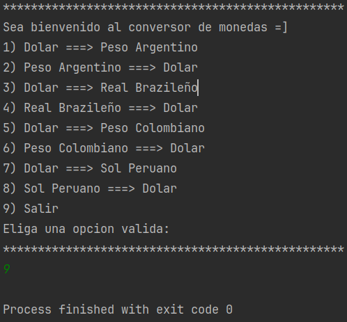
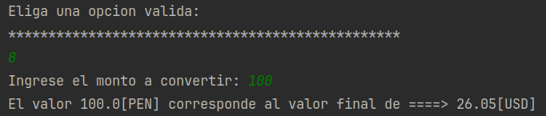
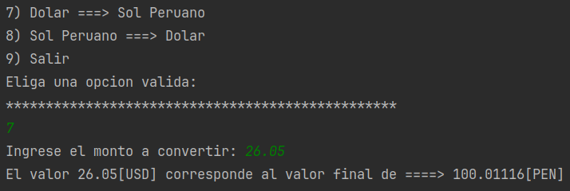
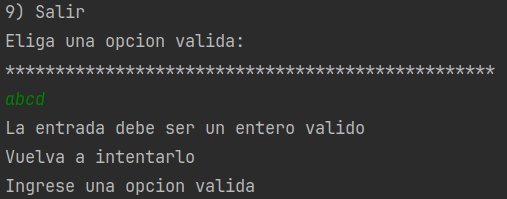

# CHALLENGE 1  
## Conversor de Monedas
### OBJETIVO  
  - Transformar el monto de una determinada moneda (X) a USD
  - Transformar de USD -> (X)

### DESARROLLO  
1. RECURSOS  
   - Para obtener las conversiones se uso la pagina: https://www.exchangerate-api.com/
   - Se uso Maven para usar Gson
   - Se uso java 17  
   - IntelliJ Community Edition
   
2. ARCHIVO "ActualCurrencies.txt"  
   Contiene la siguiente lista:
   ```
   ARS,Peso Argentino  
   BRL,Real Brazileño  
   COP,Peso Colombiano  
   PEN,Sol Peruano
   ```
   Este archivo es leido por el programa y determina la cantidad de opciones, de la siguiente manera:  
   - Dado que por cada moneda se debe hacer una conversion a USD, entonces si existen 4 monedas deben existir 8 opciones y 1 opcion adicional para salir del programa.  
   Entonces la regla es: ( NumeroMonedas x 2 ) + 1

3. MENU DE OPCIONES  
Al iniciar el programa, cada par es registrado con una clave entre [1 - NumeroMonedas].  
Si el usuario selecciona la opcion 1 o 2 ambos se parsearan a 1, del mismo modo con (3, 4); {5, 6}; {7, 8} a 2, 3 y 4 respectivamente  
Con ello se puede acceder al Map que contiene esas claves y cambiar el orden de conversión dependiendo de si es par o impar la opcion escogida [1 - 8]  
    
4. EJECUCIÓN  
   - Opcion salir  
   
   - Convertir SOL a USD  
   
   - Convertir USD a SOL  
   
   - En caso se de una opcion invalida  
   